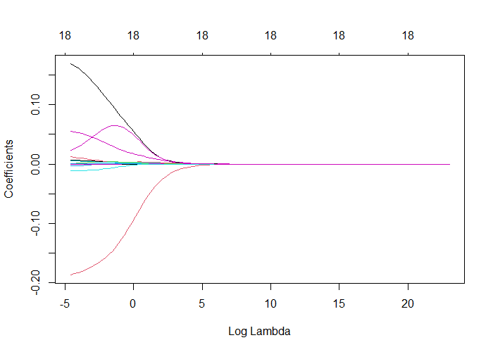
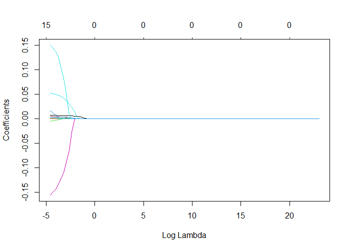
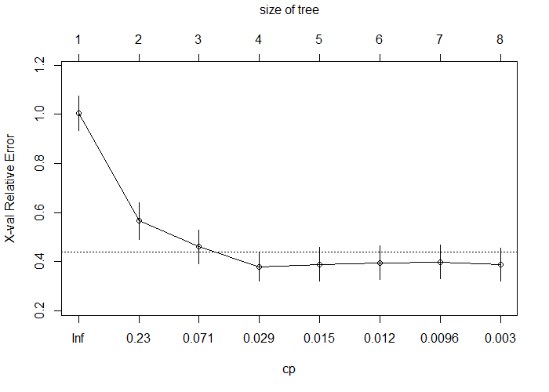
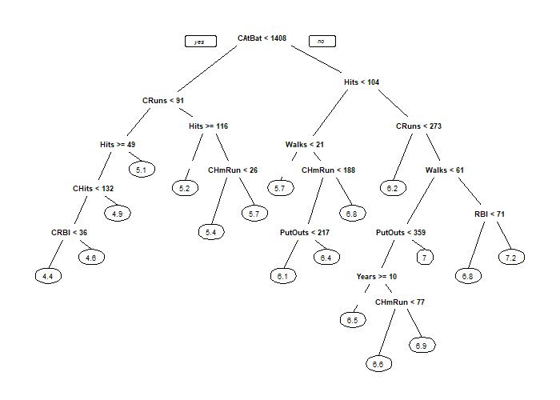
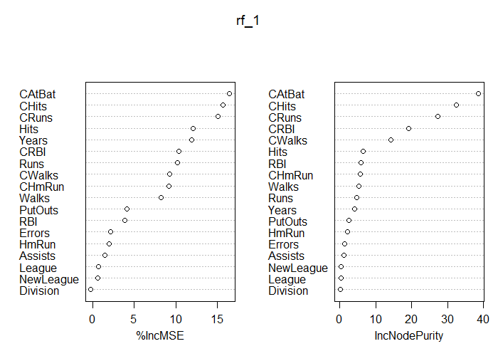
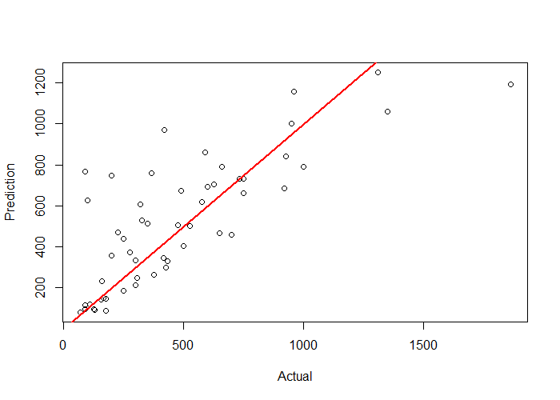

# R_CS_05
Sports Analytics in R (Regularization and DecisionTree based approaches for Regression problems)

### Case-Study Title: Sports Analytics (Regularization and DecisionTree based approaches for Regression problems)
### Data Analysis methodology: CRISP-DM
### Dataset: Hitters dataset (Major League Baseball Data from the 1986 and 1987 seasons in US)
### Case Goal: Annual Salary prediction of each Player in 1987 base on his performance in 1986

Regression Coefficients versus Log lambda in Ridge Regression

Regression Coefficients versus Log lambda in LASSO Regression

CP table in Desicion Tree

Pruned Desicion Tree

Importance table of predictor variables in RandomForest

Actuals versus Predictions plot

